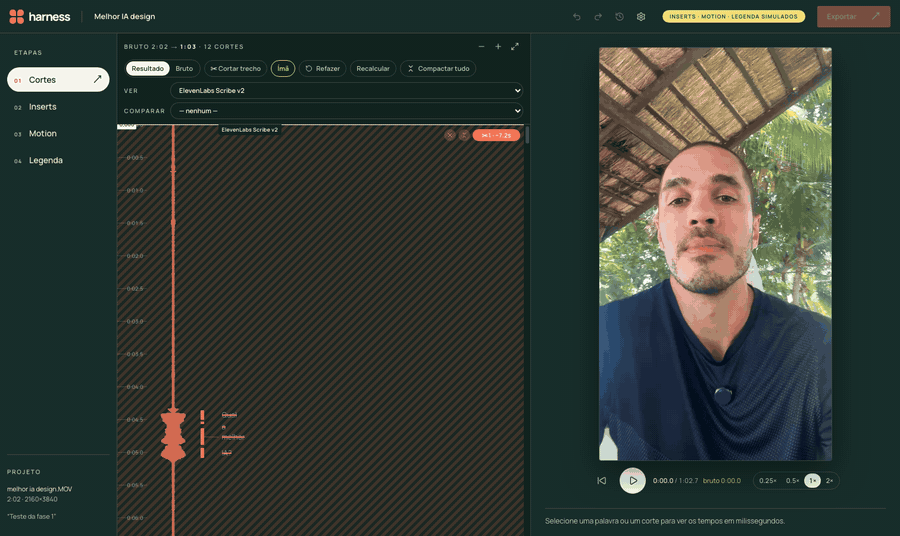
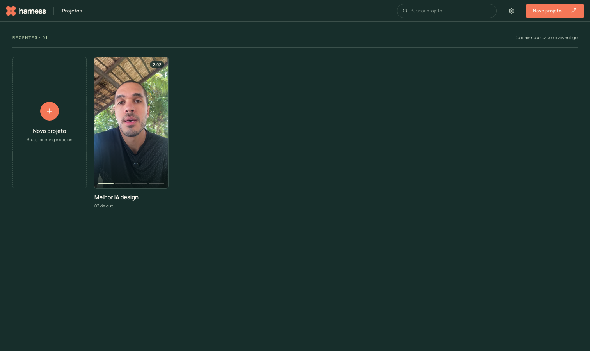
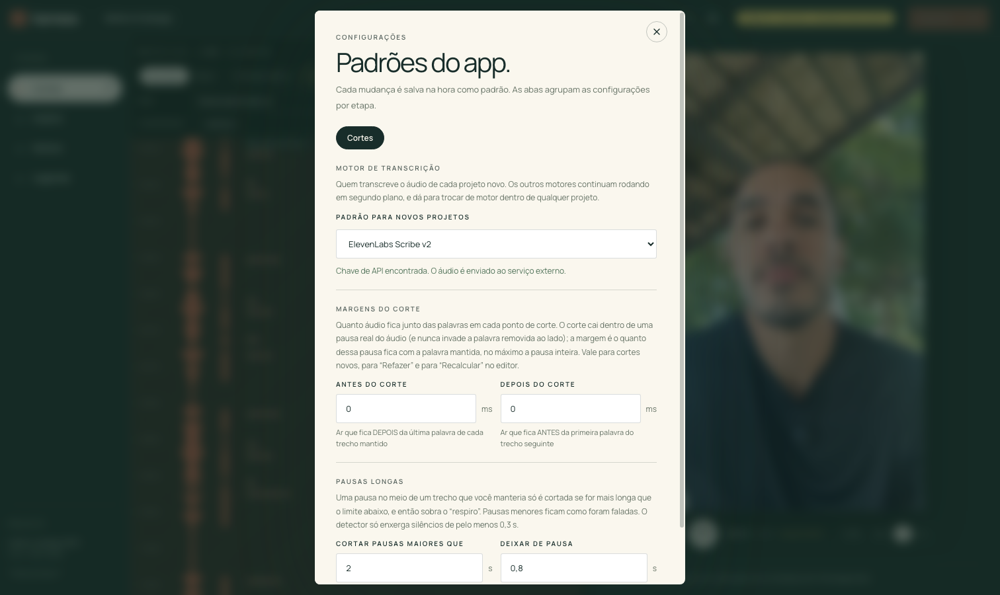

# Harness Video Editor

Editor de vídeo local onde a **IA faz cada etapa da edição** e você corrige numa interface no estilo Premiere.



Você sobe o vídeo bruto e a IA propõe a edição, etapa por etapa: **Cortes → Inserts → Motion → Legenda**. Cada etapa tem controles manuais para corrigir o que a IA decidiu, e o render final só acontece depois que os cortes são aprovados.

> **Estado atual:** a etapa de **Cortes** é real. A **Direção visual** (o que aparece na tela em cada momento) está sendo treinada: a tela **Referências** já analisa seus vídeos editados com IA multimodal e permite revisar o resultado; a proposta para vídeos novos vem depois. Inserts, Motion e Legenda são mocks. O agente de chat e o render final ainda não foram feitos.

## O que a etapa de Cortes faz

1. Gera um proxy 720p do vídeo, detecta silêncios e desenha a forma de onda.
2. Transcreve o áudio com timestamps por palavra. O motor padrão é o **ElevenLabs Scribe v2**, e dá para trocar em Configurações. Os outros motores (Whisper + stable-ts, Qwen3-ASR, Parakeet, entre outros) rodam em segundo plano e dá para comparar dois lado a lado.
3. Um LLM (via OpenRouter) decide **quais palavras ficam**, tirando retomadas, erros e falsos começos. O código calcula os tempos exatos e cola o corte dentro de uma pausa real do áudio.
4. Você revisa numa **linha do tempo vertical**, com a onda e cada palavra no seu milissegundo:
   - arrastar a borda de um corte, com ímã nas palavras e pausas;
   - **✂ Cortar trecho** para criar um corte à mão e **✕** para excluir um corte;
   - Resultado ou Bruto, velocidade de play de 0,25× a 2×, e Expandir ou Compactar tudo;
   - **Refazer** (pede nova seleção à IA) e **Recalcular** (refaz os trechos com as margens atuais, sem chamar a IA).
5. **Configurações → Cortes** (salvas na hora como padrão): motor de transcrição, margens antes e depois do corte, e a partir de quantos segundos uma pausa dentro de um trecho mantido é encurtada.

| Projetos | Configurações |
|---|---|
|  |  |

## Referências (treino da Direção visual)

Na aba **Referências** da tela inicial você sobe Reels já editados (vários de uma vez). Cada um é analisado em segundo plano: o detector de cena acha os cortes, a fala é transcrita e um modelo multimodal (Gemini via OpenRouter) diz, trecho a trecho, qual **plano-base** está na tela (Full ator, Insert tela cheia, Motion tela cheia, Tela dividida) e quais **elementos** aparecem por cima (lettering, palavra ManyChat, caixinha de perguntas, print), com descrição, texto exato e a função de cada um. Você revisa numa timeline vertical e marca como revisada; as estatísticas mostram seu padrão de edição (duração típica de cada plano, onde eles entram na fala etc.).

## Como rodar

**Requisitos:** macOS com Apple Silicon (o proxy usa VideoToolbox e os modelos locais usam MLX), [uv](https://docs.astral.sh/uv/), Node 20+ e `ffmpeg` (com `ffprobe`) no PATH.

```bash
git clone https://github.com/rtadewald/harness-video-editor.git
cd harness-video-editor
```

Crie `backend/.env` com as chaves (o arquivo é ignorado pelo git):

```env
OPENROUTER_API_KEY=...        # obrigatória: o LLM que escolhe o que fica
OPENROUTER_MODEL=google/gemini-3.8-flash
ELEVENLABS_API_KEY=...        # opcional: motor de transcrição padrão
```

Sem `ELEVENLABS_API_KEY` o app usa Whisper + stable-ts localmente e avisa o motivo. O ElevenLabs envia o áudio da sua voz a um serviço externo.

Suba tudo com um comando:

```bash
./dev.sh
```

- Interface: http://localhost:5173
- API: http://localhost:8000 (FastAPI)

Na primeira vez os modelos locais baixam sozinhos, o que demora um pouco. Os projetos ficam em `projetos/` (ignorada pelo git).

### Testes

```bash
cd backend && uv run pytest -q     # não usa chaves nem rede
cd frontend && npm run build       # checa os tipos e gera o bundle
```

## Estrutura

```
backend/    FastAPI + pipeline (proxy, silêncios, transcrição, cortes por LLM)
frontend/   React + Vite + Tailwind (linha do tempo vertical, player, configurações)
SPEC.md     especificação completa e aprendizados medidos de cada motor
AGENTS.md   regras de trabalho do projeto
docs/img/   prints e GIF deste README
```

A especificação detalhada, incluindo as regras editoriais de corte (§14) e a comparação medida entre motores de transcrição (§16), está em [SPEC.md](SPEC.md).
